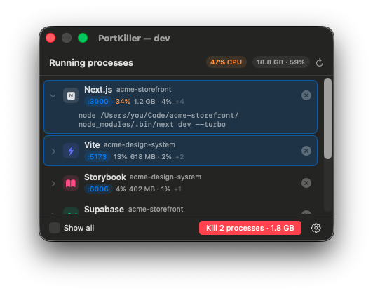

<div align="center">


# PortKiller

**Kill the dev servers you forgot about.**

A macOS menu bar app that lists what's still running, which port it holds
and what it costs you — then kills it in one click.




</div>

---

## Install

**Download** the `.dmg` from [Releases](https://github.com/javimogan/PortKiller/releases),
open it, drag PortKiller onto Applications. That's it — the app is signed with a Developer ID
and notarised by Apple, so it opens with no warnings and no Gatekeeper detour.

**Or build it yourself:**

```bash
git clone https://github.com/javimogan/PortKiller.git
cd PortKiller && ./install.sh
```

Either way, enable **Launch at login** in the ⚙️ menu and forget it's there.
Building needs macOS 14+ and a Swift 6 toolchain (Xcode).

To **uninstall**, use ⚙️ ▸ *Uninstall PortKiller*: it quits, removes the login item, forgets
its preferences and puts the app in the Trash. Nothing is left behind and nothing is deleted
outright, so you can still change your mind from the Trash.

## What it shows

Each row is a **process tree**, not a process: `pnpm dev` and the `next-server` it spawned
are one "Next.js" entry, and killing it takes the children with it.

- **Name** — Next.js, Vite, Astro, Storybook, Postgres, Docker… read off the command line
- **Project** — the process's working directory
- **Ports** — click one to open `http://localhost:PORT`
- **CPU and memory** — summed across the tree; the header shows the whole machine
- **`+N`** — how many child processes go down with it

Apps that live in a `.app` show their real macOS icon; dev tools, which the system has no
icon for, get their brand colour instead.

Only processes owned by your user are listed — root daemons can't be killed anyway. Your
editor, Claude and MCP servers are marked 🔒 and left out of **Kill all**, though you can
still kill them one at a time.

## Interacting

| Action | What it does |
|---|---|
| Click a row | Selects it. Click again to deselect, click more rows for several |
| The red button | `Kill all` with nothing selected, `Kill Next.js · 1.0 GB` once something is |
| Chevron on the left | Expands the full command line |
| `×` on the right | Kills that entry without selecting it |
| Port badge | Opens `http://localhost:PORT` |

## How it works

**Finding things** — `lsof` for listening ports, `ps` for the process tree, then every
interesting process is rolled up to its topmost interesting ancestor so a dev server and its
wrapper collapse into one row. Shells are never anchors: they repeat the whole command line
in their own arguments and would swallow the tree.

**Killing** — `SIGTERM` to the whole tree, deepest child first. Anything still alive 2.5s
later gets `SIGKILL`.

**Battery** — the list refreshes every 3s **only while the panel is open**. Closed, the app
does nothing; a background poller would be exactly the drain it exists to remove.

## Development

```bash
./dev.sh           # rebuild on save (~1s) and relaunch, with a floating window
./dev.sh --demo    # same, with fake processes — for screenshots
```

The window keeps its position across reloads, so you watch changes land without reopening
the menu. For layout only, open `Package.swift` in Xcode and use the `#Preview` at the end
of `MenuView.swift`.

```bash
.build/release/PortKiller --list    # prints what the menu would show
./release.sh 1.1                    # drag-to-Applications DMG in dist/
```

`release.sh` signs with the **Developer ID Application** certificate, notarises the app,
staples the ticket, then repeats it for the disk image. It needs `notarytool` credentials in
the keychain under the profile `portkiller` — see the header of the script. Without a
Developer ID it still builds a working DMG, just one that warns on first launch.

If a tool is mislabelled or missing, add a pattern to `rules` in
[`Scanner.swift`](Sources/PortKiller/Scanner.swift) — ordered by specificity, first match wins.
